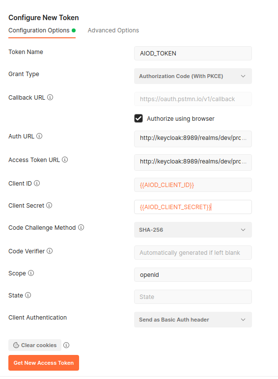

# Keycloak Service 

When running the metadata catalogue in production, you want to ensure that users can authenticate
so that proper authorization over the endpoints can take place.
In many cases, you will likely not host the keycloak service yourself, but instead connect to a 
preconfigured keycloak server (such as the one hosted by [EGI](https://www.egi.eu)).

## Connecting to Keycloak
To connect the metadata catalogue to a pre-existing keycloak service set the following environment 
variables (preferably through the `override.env` file):

 * `HOSTNAME`: E.g., auth.aiod.eu
 * `AIOD_KEYCLOAK_PORT`: E.g., 8081
 * `REDIRECT_URIS`: URI a successful login action should redirect back to. E.g., https://${HOSTNAME}/docs/oauth2-redirect
 * `POST_LOGOUT_REDIRECT_URIS`: URI a successful logout action should redirect back to. E.g., https://${HOSTNAME}/aiod-auth/realms/aiod/protocol/openid-connect/logout

As well as the `openid_connect_url` in `./src/config.override.toml` (for authentication on the Swagger page):
```toml
[keycloak]
openid_connect_url = "https://auth.aiod.eu/aiod-auth/realms/aiod/.well-known/openid-configuration"
```

## Hosting Keycloak Locally

Running locally is possible, but is not recommended when you wish to use external identity providers.
The problem is that the dockerized API thinks that the keycloak is located at host `keycloak` (the name of the keycloak docker), 
while our keycloak console thinks that it's hosted at `localhost`. This is a problem for the authentication. 
The url of the keycloak is embedded in the token (the `iss` field), 
and must be the same as the url that the API uses, otherwise the API cannot authenticate the user. 
But when accessing e.g., the Google Identity Provider, Google requires the redirect-url to be localhost.

[//]: # (Should include information on how to run it locally then...)

## Roles

The table below gives an overview of the different roles which are used in AI-on-Demand:

| Role                | Comment                                       |
|---------------------|-----------------------------------------------|
| edit_aiod_resources | Allows the user to upload and edit resources. |
| default-roles-aiod  | ???                                           |
| offline_access      | ???                                           |
| uma_authorization   | ???                                           |

Note that some roles may be used for services other than the metadata catalogue.

[//]: # ( Are we missing roles? Check admin console. Are all roles still relevant? delete if not)

## Verifying Keycloak is Working

=== "Swagger"

      To verify the Keycloak service is configured correctly (in production), 
      - Go to http://localhost:8000/docs in your favourite browser
      - Go to `/authorization_test`, click on `try it out` and `execute`. You should get an `Error: Unauthorized`
      - Log in
          - using `Authorize` button in the top right
          - Use `OpenIdConnect (OAuth2, authorization_code with PKCE)`
          - click `Authorize`
          - Use any identity provider. 
      - Go to `/authorization_test`, click on `try it out` and `execute`. 

=== "Postman"

      If you edit a collection, you can use OAuth 2.0 authorization. See image:

      

      - As `auth url`, use https://test.openml.org/aiod-auth/realms/dev/protocol/openid-connect/auth
      - As `Access token url`, use https://test.openml.org/aiod-auth/realms/dev/protocol/openid-connect/token
      - As `client id`, use `aiod-api`
      - As `client secret`, use `7qpbFTGpONBPIn9nBovgd2843BK8Khjg`

      Then, you should be able to send a `GET` to `localhost:8000/authorization_test`.


A successful response to the `/authorization_test` endpoints should result in a response like:

```json
{
  "name": "user",
  "roles": [
    "edit_aiod_resources",
    "default-roles-aiod",
    "offline_access",
    "uma_authorization"
  ]
}
```

